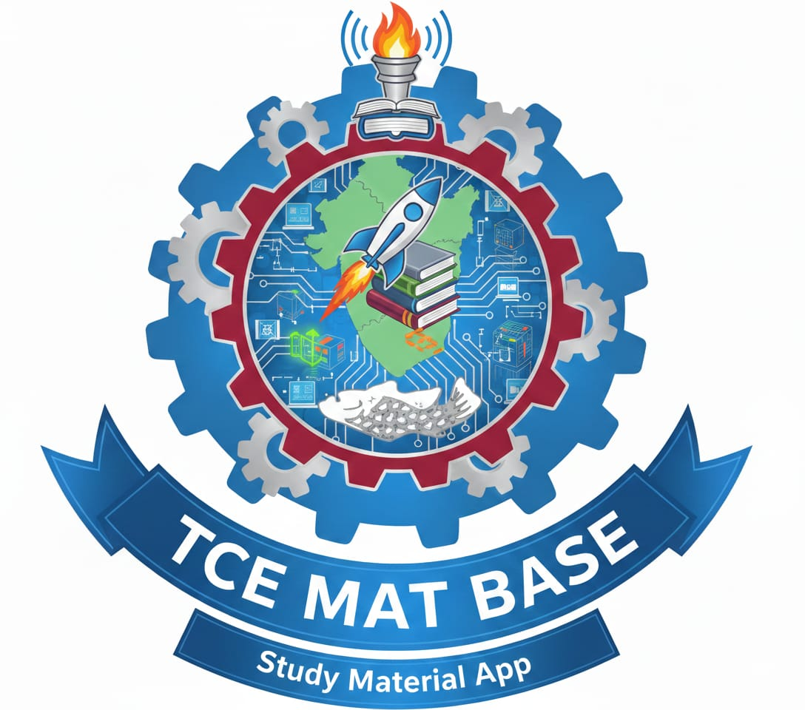

# MAT BASE - Material Management & Academic Support App

<div align="center">
    
    <h2></h2>
    <h3>Comprehensive Academic Resource Platform for TCE Students</h3>
</div>

## Overview

**MAT BASE** is a comprehensive Material Management and Academic Support application designed specifically for **Thiagarajar College of Engineering (TCE)** students. The app provides easy access to study materials, department-wise resources, semester-wise organization, and handy academic tools to streamline the educational experience.

The application centralizes all necessary academic resources in one professional and user-friendly platform, making it easier for students to manage their coursework and access study materials.

---

## Key Features

### 🔐 **Authentication**
- **Google Sign-In Integration** with Firebase Authentication
- Domain-restricted login (only @tce.edu and @student.tce.edu emails)
- Secure user session management with SharedPreferences
- One-click logout functionality

### 📚 **Material Management**
- Browse and manage study materials across different subjects
- Categorized materials by subject and semester
- Add new materials with name, subject, and description
- Material storage using Room Database
- Easy search and filter functionality

### 📂 **Department-Wise Organization**
- Support for multiple departments:
  - IT (Information Technology) - with dedicated Google Drive access
  - CSE (Computer Science & Engineering)
  - CSBS (Computer Science & Business Systems)
  - Mechanical Engineering
  - Mechatronics
  - Electrical & Electronics Engineering
  - Electronics & Communication Engineering
  - Civil Engineering

### 🗓️ **Semester & Subject Navigation**
- Organize materials by semester (1st to 8th)
- Subject-wise categorization
- Hierarchical navigation for easy material discovery

### 📊 **Academic Calculator Suite**
- **SGPA Predictor** - Calculate and predict Semester Grade Point Average
- **Grade Predictor** - Predict final grades based on current performance
- **Attendance Calculator** - Track and manage attendance requirements
- **Internal Marks Calculator** - Calculate internal assessment scores

### 🔍 **Google Drive Integration**
- In-app Google Drive viewer
- Direct access to department-wise resource folders
- Web-based folder browsing with zoom controls
- Seamless authentication with Google accounts

### 👤 **User Profile Management**
- View profile information (name, email, photo)
- Profile picture display with circular cropping
- Quick access to settings
- About Us page with team information

### ⚙️ **Additional Features**
- **Responsive UI** - Supports multiple screen sizes and layouts
  - Tablet layouts (w600dp, w1240dp)
  - Phone layouts
- **Settings** - User preferences and app configuration
- **Navigation** - Multiple navigation options:
  - Navigation Drawer
  - Bottom Navigation Bar
  - Side Navigation (for large screens)
- **About Us** - Project information and team details

---

## Technology Stack

### Frontend
- **Language**: Kotlin
- **Framework**: Android (API 24 - 36)
- **UI Components**:
  - AndroidX Material Design 3
  - RecyclerView for list management
  - Constraint Layout
  - Navigation Component
  - ViewBinding

### Backend & Database
- **Database**: Room (SQLite ORM)
- **Authentication**: Firebase Authentication
- **Analytics**: Firebase Analytics
- **Image Loading**: Coil

### Build & Dependency Management
- **Build System**: Gradle Kotlin DSL (build.gradle.kts)
- **Target SDK**: 36
- **Min SDK**: 24
- **Java Compatibility**: Version 11
- **Kotlin Code Style**: Official

---

## Project Structure

```
TCE_MAT_BASE/
├── app/
│   ├── src/
│   │   ├── main/
│   │   │   ├── java/com/example/matbase/
│   │   │   │   ├── MainActivity.kt                          # Main activity with navigation
│   │   │   │   ├── data/
│   │   │   │   │   ├── AppDatabase.kt                       # Room database configuration
│   │   │   │   │   ├── Material.kt                          # Material data model
│   │   │   │   │   └── MaterialDao.kt                       # Database access object
│   │   │   │   └── ui/
│   │   │   │       ├── LoginFragment.kt                     # Google Sign-In
│   │   │   │       ├── DepartmentsFragment.kt               # Department selection
│   │   │   │       ├── SemestersFragment.kt                 # Semester navigation
│   │   │   │       ├── SubjectsFragment.kt                  # Subject listing
│   │   │   │       ├── MaterialsFragment.kt                 # Materials management
│   │   │   │       ├── MaterialsViewModel.kt                # Materials ViewModel
│   │   │   │       ├── GradeCalculatorFragment.kt           # Grade calculation
│   │   │   │       ├── DriveViewerFragment.kt               # Google Drive viewer
│   │   │   │       ├── profile/
│   │   │   │       │   └── ProfileFragment.kt               # User profile
│   │   │   │       ├── calculators/
│   │   │   │       │   ├── CalculatorsFragment.kt           # Calculator hub
│   │   │   │       │   ├── SGPAPredictorFragment.kt         # SGPA calculator
│   │   │   │       │   ├── GradePredictorFragment.kt        # Grade calculator
│   │   │   │       │   ├── AttendanceCalculatorFragment.kt  # Attendance calculator
│   │   │   │       │   └── InternalCalculatorFragment.kt    # Internal marks calculator
│   │   │   │       ├── settings/
│   │   │   │       │   ├── SettingsFragment.kt              # App settings
│   │   │   │       │   └── SettingsViewModel.kt
│   │   │   │       ├── about/
│   │   │   │       │   └── AboutUsFragment.kt               # About page & team info
│   │   │   │       ├── reflow/
│   │   │   │       │   ├── ReflowFragment.kt
│   │   │   │       │   └── ReflowViewModel.kt
│   │   │   │       ├── slideshow/
│   │   │   │       │   ├── SlideshowFragment.kt
│   │   │   │       │   └── SlideshowViewModel.kt
│   │   │   │       └── transform/
│   │   │   │           ├── TransformFragment.kt
│   │   │   │           └── TransformViewModel.kt
│   │   │   ├── res/
│   │   │   │   ├── layout/                                  # UI layouts for different screen sizes
│   │   │   │   ├── drawable/                                # Images and icons
│   │   │   │   ├── values/
│   │   │   │   │   ├── strings.xml                          # String resources
│   │   │   │   │   ├── colors.xml                           # Color definitions
│   │   │   │   │   ├── themes.xml                           # Theme configuration
│   │   │   │   │   └── dimens.xml                           # Dimension values
│   │   │   │   └── menu/                                    # Navigation menus
│   │   │   └── AndroidManifest.xml                          # App manifest
│   │   └── androidTest/                                     # Instrumented tests
│   ├── build.gradle.kts                                    # App-level build configuration
│   └── proguard-rules.pro                                  # ProGuard configuration
├── build.gradle.kts                                        # Root build configuration
├── settings.gradle.kts                                     # Build settings
├── gradle.properties                                       # Gradle properties
├── local.properties                                        # Local build configuration
└── README.md                                               # This file

```

---

## Installation & Setup

### Prerequisites
- Android Studio Arctic Fox or later
- Android SDK (API level 24-36)
- Java Development Kit (JDK 11 or higher)
- Git (for cloning the repository)

### Steps to Build & Run

1. **Clone the Repository**
   ```bash
   git clone https://github.com/aswin-git-dev/TCE_MAT_BASE.git
   cd TCE_MAT_BASE
   ```

2. **Open in Android Studio**
   - Open Android Studio
   - Select "Open an existing Android Studio project"
   - Navigate to the cloned directory and select it

3. **Firebase Configuration**
   - Create a Firebase project at [Firebase Console](https://console.firebase.google.com)
   - Download the `google-services.json` file
   - Place it in the `app/` directory
   - Enable Google Sign-In in Firebase Authentication

4. **Configure Google Sign-In**
   - Add your SHA-1 fingerprint to the Firebase Console:
     ```bash
     ./gradlew signingReport
     ```
   - The Web Client ID for Google Sign-In is configured in `LoginFragment.kt`

5. **Build the Project**
   ```bash
   ./gradlew build
   ```

6. **Run on Emulator or Device**
   - Connect an Android device or start an emulator
   - Click "Run" in Android Studio or execute:
     ```bash
     ./gradlew installDebug
     ```

---

## App Navigation

### Main Navigation Flow

```
Login Screen
    ↓
Departments Selection
    ├─ IT (→ Google Drive Viewer)
    └─ Other Departments
        ↓
        Semesters
            ↓
            Subjects
                ↓
                Materials (List, Add, View)
```

### Main Menu Options
- **Home** - Materials Management
- **Materials** - Browse and manage study materials
- **Calculators** - Academic calculation tools
- **Profile** - User account and settings
- **About Us** - Application and team information
- **Settings** - App configuration

### Navigation Components Used
1. **Navigation Drawer** - Primary navigation on phones
2. **Bottom Navigation Bar** - Quick access to main sections on phones
3. **Side Navigation** - Rail navigation for tablets (width ≥ 600dp)

---

## Features in Detail

### 🔑 Google Sign-In
- Secure OAuth 2.0 authentication via Google
- Domain validation (TCE email only)
- User data storage (name, email, profile photo)
- One-click logout with confirmation

### 📚 Material Management
- **Add Materials**: Create new material entries with name, subject, and description
- **Material Storage**: Room Database with automatic timestamp tracking
- **Material Display**: Organized list view with subject information
- **Material Organization**: Categorized by department, semester, and subject

### 🗂️ Department Structure
The app supports all major departments at TCE with special features for IT department:
- **IT Department**: Direct Google Drive integration showing all IT resources
- **Other Departments**: Semester and subject-based navigation

### 📊 Calculator Suite
Four specialized calculators for academic planning:
1. **SGPA Predictor** - Calculate semester GPA
2. **Grade Predictor** - Estimate final grades
3. **Attendance Calculator** - Track attendance percentage
4. **Internal Calculator** - Compute internal marks

### 👥 Team Member Information
The "About Us" section includes detailed information about:
- **ASWINKUMAR** - Team Leader & Full Stack Developer
- **PRAVEEN KUMAR TV** - Full Stack Developer
- **YASHWANTH KUMAR D** - Full Stack Developer & UI/UX Designer

All are 3rd year B.Tech IT students at TCE.

---

## Architecture Patterns

### MVVM (Model-View-ViewModel)
The app follows MVVM architecture:
- **Models**: Data classes (Material, etc.)
- **ViewModels**: `MaterialsViewModel`, `SettingsViewModel`, etc.
- **Views**: Fragments (MaterialsFragment, SettingsFragment, etc.)

### Database Architecture
- **Room Database** for local data persistence
- **MaterialDao** for database operations
- Single `AppDatabase` instance (singleton pattern)

### Navigation
- **Android Navigation Component** with safe args
- **Jetpack Navigation** for fragment transactions
- Multi-layout support with conditional navigation

### Authentication
- **Firebase Authentication** for backend
- **Google Sign-In** for OAuth provider
- **SharedPreferences** for local user data caching

---

## Screen Layouts

### Responsive Design
The app supports multiple screen sizes:

1. **Phone Layout** (width < 600dp)
   - Navigation Drawer
   - Bottom Navigation Bar
   - Full-width content

2. **Tablet Layout** (width ≥ 600dp)
   - Side Navigation Rail
   - Wider content area
   - Optimized spacing

3. **Large Tablet Layout** (width ≥ 1240dp)
   - Enhanced navigation
   - Multi-panel layouts
   - Additional screen estate utilization

---

## Dependencies

### Core Android
- androidx.core:core-ktx:1.x
- androidx.appcompat:appcompat:1.x
- androidx.lifecycle:lifecycle-viewmodel-ktx:2.x
- androidx.navigation:navigation-fragment-ktx:2.x

### UI
- com.google.android.material:material:1.x
- androidx.constraintlayout:constraintlayout:2.x
- androidx.recyclerview:recyclerview:1.x

### Firebase
- com.google.firebase:firebase-auth
- com.google.firebase:firebase-analytics
- com.google.android.gms:play-services-auth

### Database
- androidx.room:room-runtime
- androidx.room:room-ktx

### Image Loading
- io.coil-kt:coil:2.x

---

## Build Configuration

### Gradle Configuration
- **compileSdk**: 36
- **targetSdk**: 36
- **minSdk**: 24
- **targetJava**: 11
- **Kotlin DSL**: Used for all build files

### Optimization
- Non-transitive R class enabled for library efficiency
- AndroidX enabled for modern APIs
- ProGuard enabled for release builds (minify disabled for testing)

---

## Development

### Version Information
- **App Version**: 1.0
- **Version Code**: 1
- **Package**: com.example.matbase

### Build Variants
- **Debug**: Development build with full logging and debugging
- **Release**: Production build with ProGuard optimization

### Testing
- **Unit Tests**: JUnit framework
- **Instrumented Tests**: Android Espresso framework
- Test runner: `androidx.test.runner.AndroidJUnitRunner`

---

## Contributors

The MAT BASE project is developed by a team of three 3rd-year B.Tech IT students at Thiagarajar College of Engineering:

| Name | Role | Responsibilities |
|------|------|------------------|
| **ASWINKUMAR** | Team Leader & Full Stack Developer | Project coordination, frontend & backend integration |
| **PRAVEEN KUMAR TV** | Full Stack Developer | Architecture design, database management |
| **YASHWANTH KUMAR D** | Full Stack Developer | UI/UX design, core application logic |

### Contact
- **Email**: matbase.tce@gmail.com
- **Website**: https://materialbase.in
- **Institution**: Thiagarajar College of Engineering (TCE)

---

## Recent Updates

### Latest Changes (v1.0)
- ✅ Google Drive integration for IT department resources
- ✅ Menu navigation corrections
- ✅ Multiple calculator tools (SGPA, Grade, Attendance, Internal)
- ✅ Google Drive folder restructuring
- ✅ Responsive UI for various screen sizes
- ✅ Firebase Authentication with domain validation
- ✅ Room Database for material management

---

## Future Enhancements

Potential features for future releases:
- [ ] Offline access to materials
- [ ] Notes and study notes feature
- [ ] Time table and schedule management
- [ ] Assignment and deadline tracking
- [ ] Exam schedule integration
- [ ] Notification system for updates
- [ ] Dark mode support
- [ ] Multilingual support

---

## Troubleshooting

### Common Issues

**Issue**: "Sign-in failed - Developer Error"
- **Solution**: Ensure your SHA-1 fingerprint is added to Firebase Console

**Issue**: Google Drive viewer shows blank
- **Solution**: Check internet connectivity and ensure JavaScript is enabled

**Issue**: Materials not showing in list
- **Solution**: Verify Room Database is properly initialized and add test data

**Issue**: App crashes on login
- **Solution**: Verify Firebase configuration is correct and google-services.json is in app/ directory

---

## License
This project is developed for academic purposes at Thiagarajar College of Engineering.

---

## Acknowledgments
- Built with ❤️ for TCE students
- Thanks to the Android community and Firebase for excellent documentation
- Special thanks to TCE administration for support

---

## Contact & Support

For issues, questions, or feature requests:
- **Email**: matbase.tce@gmail.com
- **Website**: https://materialbase.in
- **GitHub Issues**: Report bugs via GitHub issues

---

**Last Updated**: April 2026
**Project Status**: Active Development (v1.0)
